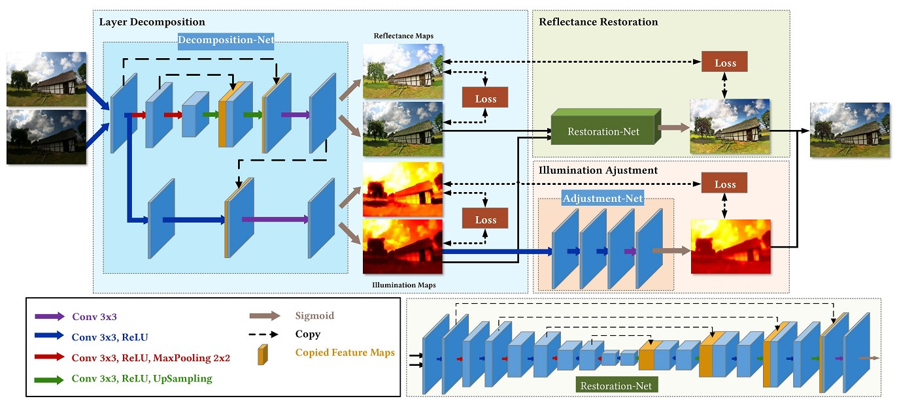
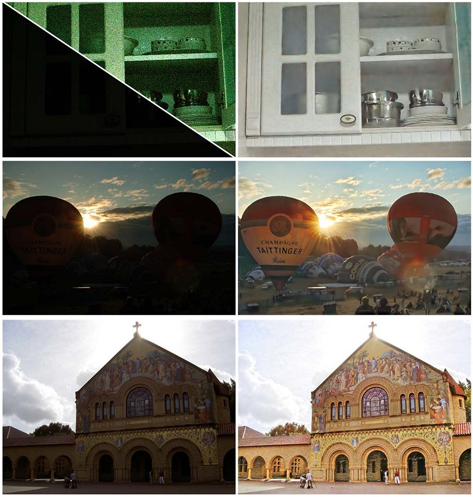

# KinD
This is a Tensorflow implementation of KinD

### The [KinD++](https://github.com/zhangyhuaee/KinD_plus) is an improved version. ###

Kindling the Darkness: a Practical Low-light Image Enhancer. In ACMMM2019<br>
Yonghua Zhang, Jiawan Zhang, Xiaojie Guo

### [Paper](http://doi.acm.org/10.1145/3343031.3350926)




### Requirements ###
1. Python
2. Tensorflow >= 1.10.0
3. numpy, PIL

### Test ###
First download the pre-trained checkpoints from [BaiduNetdisk](https://pan.baidu.com/s/1c4ZLYEIoR-8skNMiAVbl_A) or [google drive](https://drive.google.com/open?id=1-ljWntl7FExf6BSQtl5Mz3rMGWgnXDz4), then just run
```shell
python evaluate.py
```
Our pre-trained model has changed. Thus, the results have some difference with the report in our paper. However, you can adjust the illumination ratio to get better results.

### Train ###
The original LOLdataset can be downloaded from [here](https://daooshee.github.io/BMVC2018website/). We rearrange the original LOLdataset and add several all-zero images to improve the decomposition results and restoration results. The new dataset can be download from [BaiduNetdisk](https://pan.baidu.com/s/1sn3vWJ2I5U2dlVUD7eqIBQ) or [google drive](https://drive.google.com/open?id=1-MaOVG7ylOkmGv1K4HWWcrai01i_FeDK). Save training pairs of LOL dataset under './LOLdataset/our485/' and save evaluating pairs under './LOLdataset/eval15/'. For training, just run
```shell
python decomposition_net_train.py
python adjustment_net_train.py
python reflectance_restoration_net_train.py
```
You can also evaluate on the LOLdataset, just run
```shell
python evaluate_LOLdataset.py
```
Our code partly refers to the [code](https://github.com/weichen582/RetinexNet).

### Citation ###
```
@inproceedings{zhang2019kindling,
 author = {Zhang, Yonghua and Zhang, Jiawan and Guo, Xiaojie},
 title = {Kindling the Darkness: A Practical Low-light Image Enhancer},
 booktitle = {Proceedings of the 27th ACM International Conference on Multimedia},
 series = {MM '19},
 year = {2019},
 isbn = {978-1-4503-6889-6},
 location = {Nice, France},
 pages = {1632--1640},
 numpages = {9},
 url = {http://doi.acm.org/10.1145/3343031.3350926},
 doi = {10.1145/3343031.3350926},
 acmid = {3350926},
 publisher = {ACM},
 address = {New York, NY, USA},
 keywords = {image decomposition, image restoration, low light enhancement},
}
```
